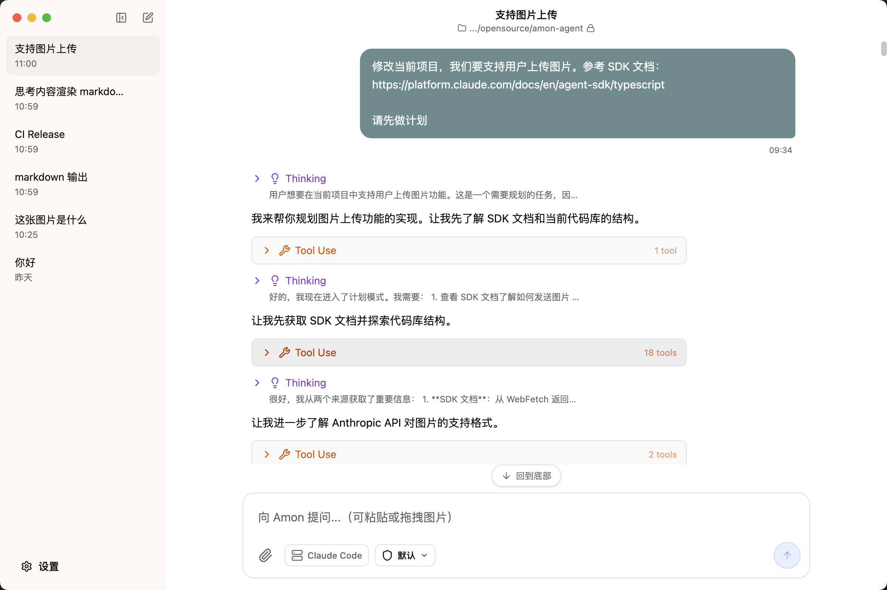
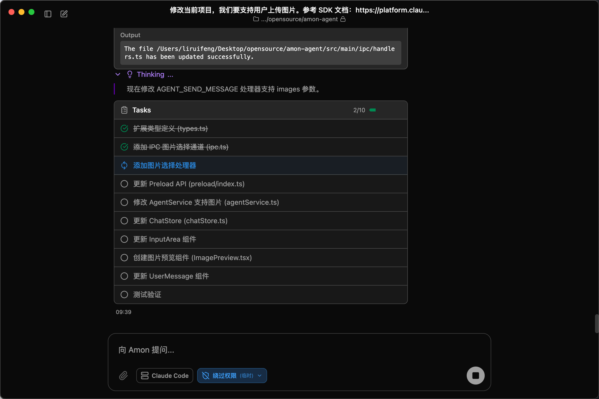
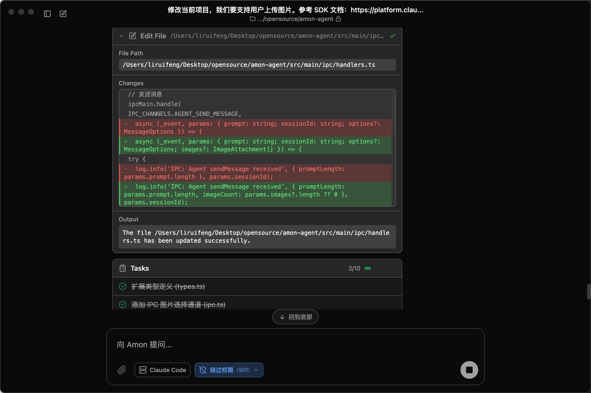
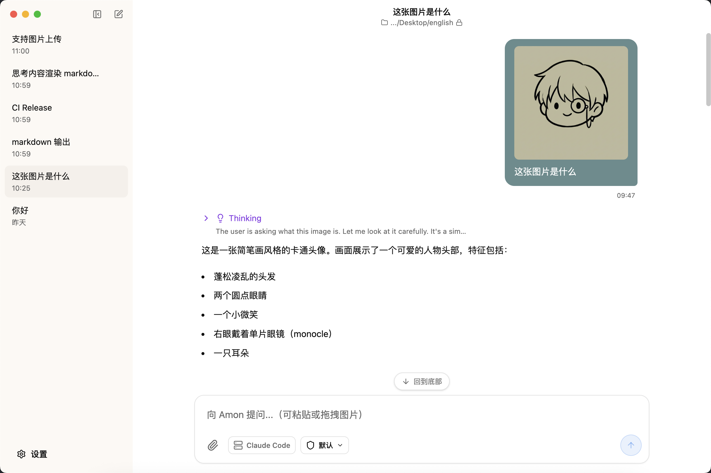
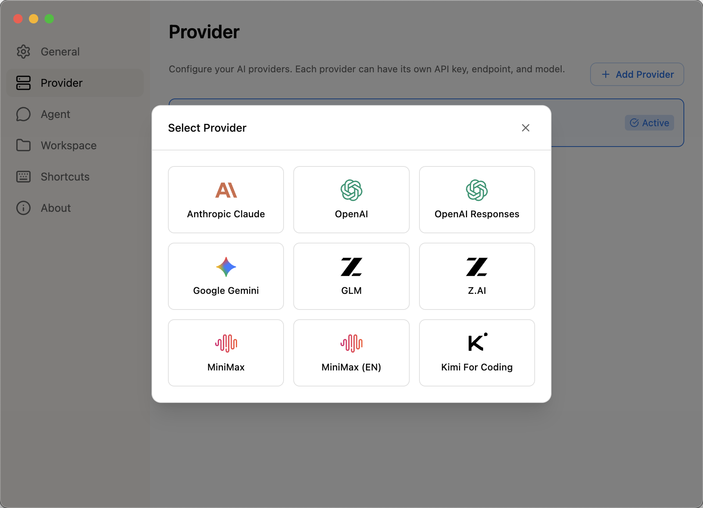
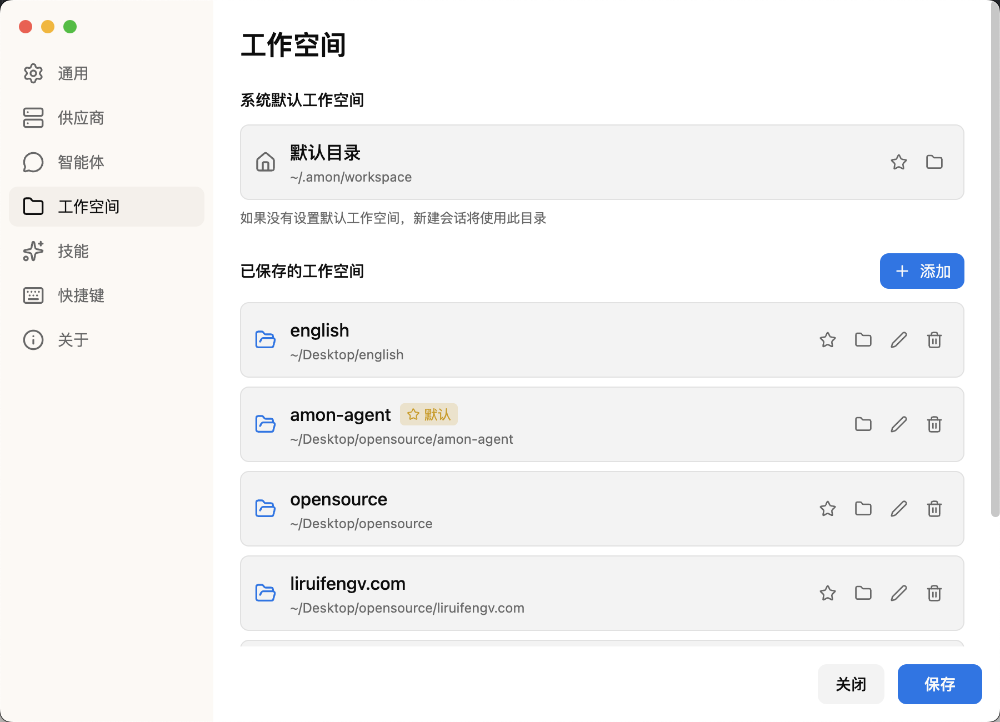

<div align="center">
  
  <h1>Amon Coworker</h1>
  <p>你的桌面 AI 工作伙伴</p>

  中文 | <a href="./README.md">English</a>

  <a href="https://www.gnu.org/licenses/agpl-3.0"></a>
  <a href="https://www.electronjs.org/"></a>
  <a href="https://react.dev/"></a>
  <a href="https://www.typescriptlang.org/"></a>
  <a href="https://zod.dev/"></a>
</div>

## 关于 Amon

Amon 是运行在本地的智能 AI Coworker。它不仅能与你对话，还能真正帮你完成工作：编写代码、执行命令、搜索信息、管理文件。

Amon 采用自研的三层 Agent 架构，内置 Provider 无关的 AI 流式调用层，开箱即用支持 Anthropic Claude、OpenAI、Google Gemini 以及任何 API 兼容的供应商。

从 `0.3.0` 开始，Amon 不再依赖 Claude Agent SDK。运行时已经完全迁移为仓库内实现的 Provider 无关 AI 层、框架无关 Agent 核心和 Electron 集成层。

## 0.3.0 重大变更

- 已移除 Claude Agent SDK，改为使用 Amon 自己实现的 Agent 核心和运行时。
- 设置和 Provider 配置迁移到了新的 `agent.providerConfigs[]` / `agent.activeProviderId` / `agent.activeModelId` 结构。
- 现有设置会尽力自动迁移，但旧的 provider 专有字段和已废弃配置项在升级后可能需要手动重新配置。


## 功能速览

我们来看看截图预览 Amon 的功能。



Amon 可以根据你发送的消息，进行思考，执行工具调用，完成你的任务。



Amon 拥有深色/浅色主题模式。



Amon 可以展示文件修改 diff 内容。



Amon 支持发送图片消息。



Amon 可以自定义添加多个 API 供应商，内置支持 Anthropic Claude、OpenAI、Google Gemini，以及 API 兼容的供应商（GLM、MiniMax、Kimi 等）。



Amon 以工作空间（文件夹）为单位来进行工作，你可以设置多个工作空间。默认工作空间：`~/.amon/workspace`

## 快速开始

### 安装

访问 [Releases](https://github.com/liruifengv/amon-agent/releases) 页面下载对应平台的安装包。

#### macOS 用户注意

由于应用未进行 Apple 签名，macOS 可能会阻止应用运行。下载后请在终端执行以下命令移除隔离属性：

```bash
xattr -cr /Applications/Amon.app
```

### 配置

首次启动后，按以下步骤配置：

1. **配置 AI 供应商**

   进入 `设置` → `供应商`，创建并启用你要使用的 AI 供应商

2. **创建工作空间**

   进入 `设置` → `工作空间`，创建新工作空间并选择本地文件夹作为项目根目录

   默认工作空间：`~/.amon/workspace`

3. **开始使用**

   返回主界面，点击 `新建会话`，选择工作空间即可开始对话


## 开发指南

### 环境要求

- Node.js 18+ 或 Bun 1.0+
- macOS / Windows / Linux

### 开发命令

```bash
bun install            # 安装依赖
bun start              # 启动开发服务器（支持热重载）
bun run lint           # 代码检查
bun run typecheck      # 类型检查
bun run test           # 运行测试
bun run changeset      # 创建 changeset
bun run version        # 应用 changeset 并更新 CHANGELOG
```

### 构建和打包

```bash
bun run download:binaries  # 下载运行时二进制文件（bun、uv）
bun run package            # 创建应用包（不创建安装器）
bun run make               # 创建平台安装包
```

### 项目结构

```
amon-agent/
├── src/
│   ├── ai/            # Provider 无关的 AI 流式调用层
│   │   ├── providers/ # 内置 Provider（Anthropic、OpenAI、Google）
│   │   └── utils/     # 事件流、JSON 解析、溢出检测
│   ├── agent/         # 框架无关的 Agent 类和循环
│   ├── main/          # Electron 主进程
│   │   ├── agent/     # Electron 特定的 Agent 集成
│   │   ├── ipc/       # IPC 通信处理
│   │   ├── store/     # 状态管理和持久化
│   │   ├── tools/     # 8 个内置工具（bash、read、write、edit 等）
│   │   ├── skills/    # Skill 加载与解析
│   │   └── workspace/ # 用户文件加载（AGENTS.md、SOUL.md）
│   ├── renderer/      # React 渲染进程
│   │   ├── components/# UI 组件
│   │   └── store/     # Zustand 状态管理
│   ├── preload/       # contextBridge IPC 桥接
│   ├── shared/        # 共享类型、Schema、常量
│   └── locales/       # 国际化文件（en、zh）
├── resources/
│   ├── icons/         # 应用图标
│   └── [bun, uv]     # 运行时二进制文件
├── skills/           # 随应用一起打包的内置 Skills
└── forge.config.ts    # Electron Forge 配置
```

## 架构

Amon 采用三层 Agent 架构，各层之间解耦清晰：

```
┌─────────────────────────────────────────────┐
│  src/ai/        AI 流式调用层                │  Provider 无关，多供应商支持
│                 (Anthropic / OpenAI / Google)│  统一的流式事件模型
├─────────────────────────────────────────────┤
│  src/agent/     Agent 核心层                 │  框架无关的 Agent + 循环
│                 (状态、工具、消息)             │  双循环：工具执行 + 后续跟进
├─────────────────────────────────────────────┤
│  src/main/agent/ Electron 集成层            │  AgentService、EventAdapter
│                 (IPC、推送、持久化)           │  会话管理、系统提示词
└─────────────────────────────────────────────┘
```

- **AI 层** (`src/ai/`) — Provider 无关的流式抽象。全局 Provider 注册表，内置 4 个 Provider。将所有响应标准化为统一的 `AssistantMessageEvent` 流。
- **Agent 层** (`src/agent/`) — 框架无关的 `Agent` 类。双循环架构：内循环（LLM 调用 -> 工具执行 -> 转向检查），外循环（后续队列 -> 重复）。工具输入使用 Zod Schema 验证。
- **集成层** (`src/main/agent/`) — 将 Agent 接入 Electron。`AgentService` 按会话解析 Provider、模型、Skills 和工作区启动文件。`EventAdapter` 将 Agent 事件桥接到会话存储和推送通知。

## 技术栈

<table>
<tr>
<td valign="top" width="50%">

**核心框架**
- Electron — 跨平台桌面应用
- React 19 — UI 框架
- TypeScript — 类型安全

**AI 层**
- 自研 Provider 无关的流式调用层
- Anthropic SDK / OpenAI SDK / Google GenAI SDK
- 双循环 Agent 架构（工具执行 + 后续跟进）

**前端技术**
- Tailwind CSS + Shadcn/ui — 界面设计
- Zustand — 状态管理
- Streamdown — Markdown 流式渲染

</td>
<td valign="top" width="50%">

**构建工具**
- Vite — 极速构建
- Electron Forge — 打包分发
- Bun — 运行时和包管理

**数据与验证**
- Zod v4 — 运行时类型验证和工具输入 Schema
- Shiki — 代码语法高亮
- i18next — 国际化（en、zh）

</td>
</tr>
</table>


## 开源协议

本项目采用 [AGPL-3.0](LICENSE) 协议开源。

---

<div align="center">
  <sub>Built with ❤️ by <a href="https://github.com/liruifengv">@liruifengv</a></sub>
</div>
